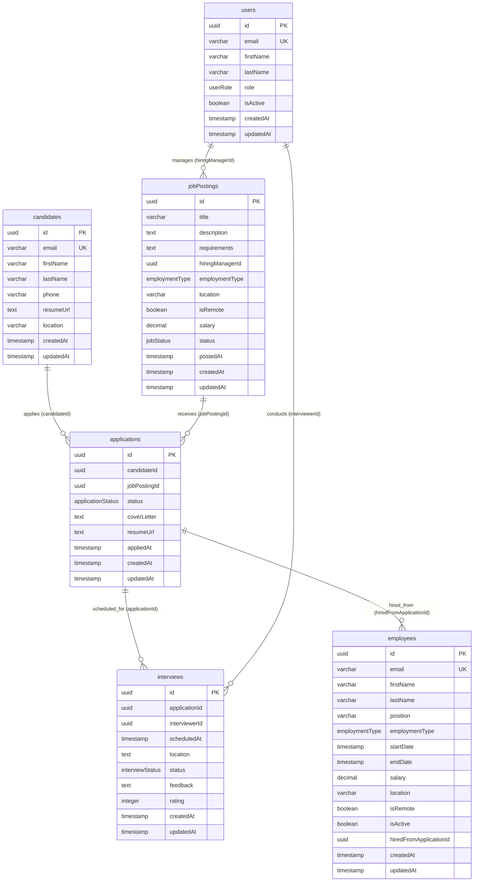

# Database Schema Diagram

This diagram represents the database schema for the hiring/recruitment management system defined in `schema.ts`.

## Schema Overview

**Core Entities:**
- **users** - System users with roles (admin, recruiter, hiring manager)
- **candidates** - Job applicants with contact information and resumes
- **jobPostings** - Available positions with requirements and details
- **employees** - Hired staff members with employment details

**Process Entities:**
- **applications** - Links candidates to specific job postings with status tracking
- **interviews** - Scheduled interview sessions with feedback and ratings

**Key Features:**
- All foreign key relationships are maintained at the application level (no database constraints)
- UUID v7 primary keys for all entities
- Comprehensive indexing for performance optimization
- Audit trails with createdAt/updatedAt timestamps
- Status tracking throughout the hiring process

**Logical Relationships:**
- Users can manage multiple job postings as hiring managers
- Candidates can submit multiple applications for different positions
- Job postings can receive multiple applications from candidates
- Applications can have multiple associated interviews scheduled
- Users can conduct interviews as interviewers
- Successful applications can result in hired employees

**Enums Used:**
- `jobStatus`: DRAFT, ACTIVE, CLOSED
- `applicationStatus`: APPLIED, SCREENING, INTERVIEWING, OFFER, HIRED, REJECTED
- `interviewStatus`: SCHEDULED, COMPLETED, CANCELLED
- `employmentType`: FULL_TIME, PART_TIME, CONTRACT, INTERNSHIP
- `userRole`: ADMIN, RECRUITER, HIRING_MANAGER

**Indexes:**
- Performance-optimized indexes on frequently queried fields
- Composite indexes for common query patterns
- Status-based indexes for filtering operations
- Date-based indexes for time-range queries

**Data Integrity:**
- Application-level referential integrity (no database foreign key constraints)
- Unique constraints on email fields across users, candidates, and employees
- Default values for status fields and boolean flags
- Automatic timestamp management for audit trails 