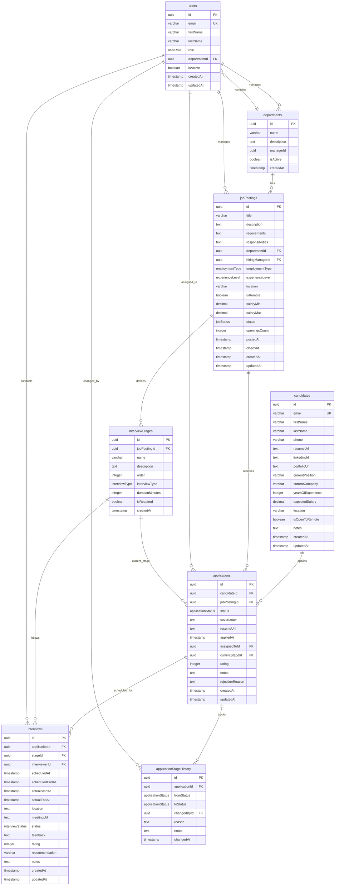

# Database Schema Diagram

This diagram represents the database schema for the hiring/recruitment management system defined in `schema.ts`.

## Schema Overview

**Core Entities:**
- **users** - System users with roles (admin, recruiter, hiring manager, interviewer)
- **departments** - Organizational units
- **candidates** - Job applicants
- **jobPostings** - Available positions

**Process Entities:**
- **applications** - Links candidates to specific job postings
- **interviewStages** - Defines interview process steps for each job
- **interviews** - Scheduled interview sessions
- **applicationStageHistory** - Audit trail of application status changes

**Key Relationships:**
- Users belong to departments and can manage job postings
- Job postings are linked to departments and have defined interview stages
- Candidates submit applications for job postings
- Applications progress through interview stages with scheduled interviews
- All status changes are tracked in the history table

**Enums Used:**
- `jobStatus`: DRAFT, ACTIVE, PAUSED, CLOSED, CANCELLED
- `applicationStatus`: APPLIED, SCREENING, INTERVIEWING, OFFER, HIRED, REJECTED, WITHDRAWN
- `interviewType`: PHONE, VIDEO, ONSITE, TECHNICAL, CULTURAL
- `interviewStatus`: SCHEDULED, COMPLETED, CANCELLED, NO_SHOW
- `employmentType`: FULL_TIME, PART_TIME, CONTRACT, INTERNSHIP, TEMPORARY
- `experienceLevel`: ENTRY, JUNIOR, MID, SENIOR, LEAD, EXECUTIVE
- `userRole`: ADMIN, RECRUITER, HIRING_MANAGER, INTERVIEWER 