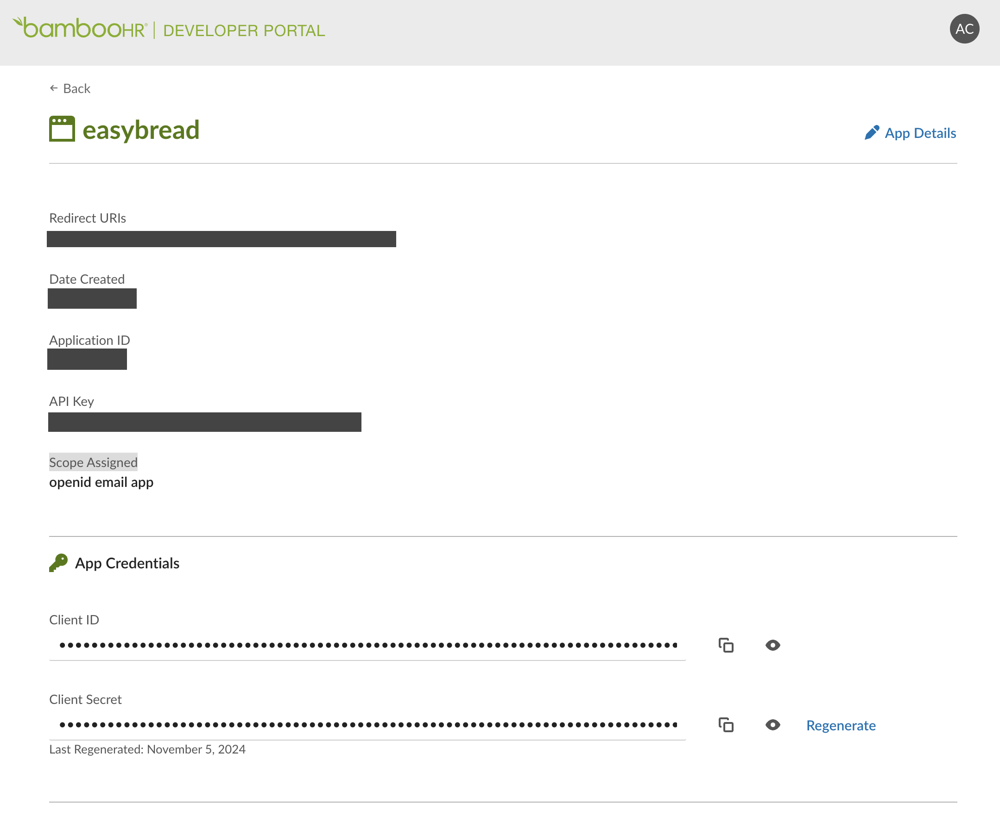

# Bamboo HR Adapter Authentication

Bamboo HR adapter supports two authentication/authorization mechanisms.
Basic Authorization with the static API Key (issued by the Bamboo HR organization admin user),  
and their own flavour of the OpenID Connect. 

## Basic Authorization

To establish the Basic Authorization, an actor must create an API Key in their Bamboo HR organization, 
and then use it to authenticate the EasyBREAD client.

One API Key gives access to one Bamboo HR organization.

```ts
import { BreadOperationName } from '@easybread/operations';

// apiKey is issued by the Bamboo HR organization admin user.
export async function adapterBaomooHrAuthenticate(
  breadId: string,
  apiKey: string,
  companyName: string
) {
  const results = await client.invoke(BreadOperationName.SETUP_BASIC_AUTH, {
    breadId,
    payload: { apiKey, companyName }
  });

  if (results.rawPayload.success === false) {
    throw new Error('Bamboo HR Setup Basic Auth Failed', {
      cause: results.rawPayload
    });
  }
}
```

## OpenID Connect Authentication

This option allows your application to authenticate users in their Bamboo HR organizations by using their Bamboo HR login and password.

Establishing the OpenID Connect authentication requires the following steps:

1. Generate the OIDC authentication URL and redirect a user to it
2. Receive the OIDC code from the callback URL and use it to get the authorization credentials and store them

### OIDC Prerequisites

Login into BambooHR developer portal, and go to your Application (create one if you don't have it yet).
It must look similar to this:



Register your redirect URI (you can register multiple).   
Then, grab "Client ID", "Client Secret", and "API Key".  
Store them in a secure place.  

> Note, never commit or share these values. They have to be kept secret.


### OIDC Configuration

Configure the OIDC options in `BambooHrAuthStrategy`

```ts
import { load } from 'ts-dotenv';

// Read the OIDC configuration from the environment or the secret manager
const {
  BAMBOO_HR_OID_CLIENT_ID,
  BAMBOO_HR_OID_CLIENT_SECRET,
  BAMBOO_HR_OID_REDIRECT_URI,
  BAMBOO_HR_OID_APPLICATION_API_KEY,
} = load({
  BAMBOO_HR_OID_CLIENT_ID: String,
  BAMBOO_HR_OID_CLIENT_SECRET: String,
  BAMBOO_HR_OID_REDIRECT_URI: String,
  // application key is the API Key for your application in BambooHR developer portal 
  //   (https://developers.bamboohr.com)
  // Don't confuse it the with the API Key for your organization in BambooHR main app 
  //   (https://{company-name}.bamboohr.com)
  BAMBOO_HR_OID_APPLICATION_API_KEY: String,
});
 
// Option 1: Setup in constructor when creatinn an instance
const authStrategy = new BambooHrAuthStrategy(stateAdapter, {
  oidcOptions: {
    clientId: BAMBOO_HR_OID_CLIENT_ID,
    clientSecret: BAMBOO_HR_OID_CLIENT_SECRET,
    redirectUri: BAMBOO_HR_OID_REDIRECT_URI,
    applicationKey: BAMBOO_HR_OID_APPLICATION_API_KEY,
  },
});

// Option 2: using configureOidc() method on an existing instance
authStrategy.configureOidc({
  clientId: BAMBOO_HR_OID_CLIENT_ID,
  clientSecret: BAMBOO_HR_OID_CLIENT_SECRET,
  redirectUri: BAMBOO_HR_OID_REDIRECT_URI,
  applicationKey: BAMBOO_HR_OID_APPLICATION_API_KEY,
});
```

### OIDC Step 1: Generate the OIDC authentication URL

Use the `BambooHrOperationName.OIDC_AUTH_START` operation to generate the OIDC authentication URL. 
Then redirect the user there.

```ts
export async function bambooHrOidcAuthStart(breadId: string, companyName: string) {
  // generate the OIDC authentication URL
  const output = await clientBambooHr.invoke(
    BambooHrOperationName.OIDC_AUTH_START,
    {
      breadId,
      payload: { companyName },
    }
  );
  
  // check if the operation was successful
  if (!output.rawPayload.success) {
    throw new Error('Bamboo HR Setup Basic Auth Failed', {
      cause: output.rawPayload.error,
    });
  }
  
  // the URL to redirect the user to
  return output.rawPayload.data.authUri;
}
```

### OIDC Step 2: Exchange the OIDC code for the authorization credentials

After the user logs in, you will receive the OIDC `code` and `state` query parameters in the callback URL.

Read them and use to call the `BambooHrOperationName.OIDC_AUTH_COMPLETE` operation.

```ts
export async function bambooHrOidcAuthComplete(breadId: string, code: string, state: string) {
  const results = await clientBambooHr.invoke(
    BambooHrOperationName.OIDC_AUTH_COMPLETE,
    {
      breadId,
      payload: { code, state },
    }
  );

  if (results.rawPayload.success === false) {
    throw new Error('Bamboo HR OIDC Auth Complete Failed', {
      cause: results.rawPayload.error
    });
  }
  
  // companyName is the company name that was used to generate the OIDC URL
  // you can use it in your app if needed.
  const { companyName } = results.rawPayload.data;
  
  return { companyName };
}
```

### OIDC under the hood

Under the hood the process is a bit more complex.

1. EasyBREAD generates the `state` parameter and store in the state alongside the given company name. The state key is derived form the `breadId`.
   We call this the `Connection Attempt` state.
2. The OIDC authentication URL is generated with the `state` parameter.
3. The user logs in and BambooHR redirects the user back to the EasyBREAD callback URL with the OIDC authentication `code` and `state` query parameters.
4. EasyBREAD retrieves the `Connection Attempt` state by `breadId` and verifies the authenticity of the `state` parameter.
5. EasyBREAD then uses the company name from the `Connection Attempt`, and OIDC auth `code` to create an `Access Token`.
6. EasyBREAD uses the access token to retrieve the `API Key` from BambooHR on behalf of the user (BambooHR will create one, if it doesn't exist yet) and stores it in the state.

The end result is the same as with the Basic Authorization method with the static API Key, but this time, 
the API Key is created and retrieved dynamically on behalf of the user using the OIDC auth credentials.  
EasyBREAD stores the `API Key`, not the `Access Token`.
