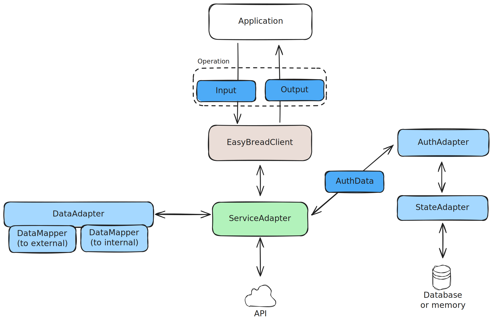
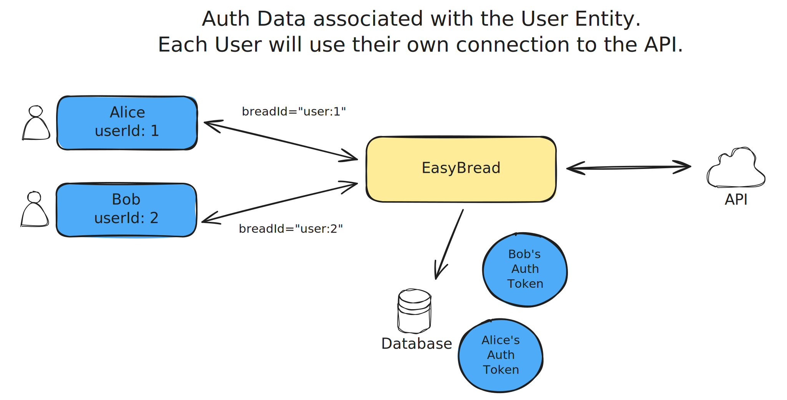
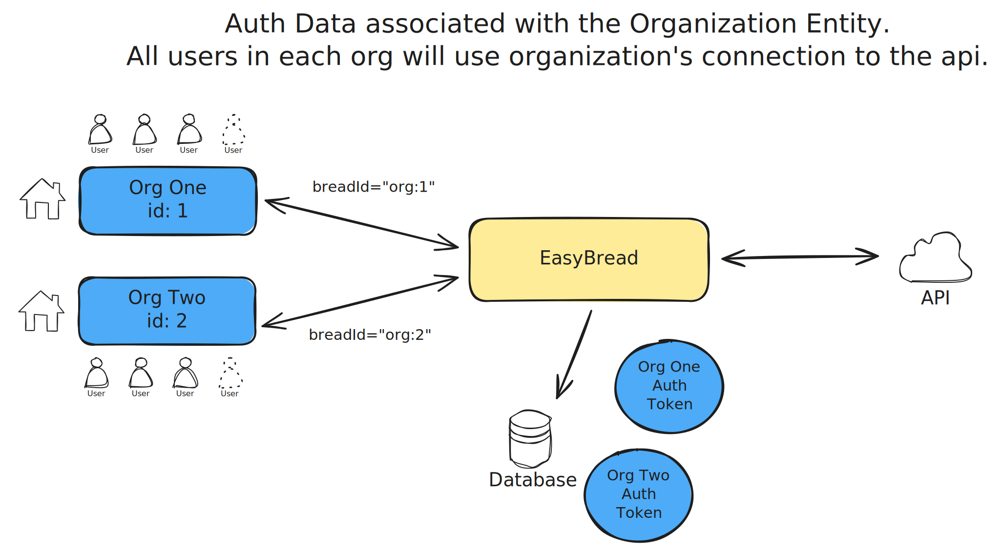

# Mental Model

EasyBREAD is an opinionated framework for building API integrations with a unified data model and interface.

## Unified Data Model

When exchanging data through the EasyBREAD, you use the BreadSchema which is derived from the 
[Schema.org](https://schema.org/) vocabulary, and strives to comply with its specifications as much as possible.

```ts
import type { PersonSchema } from '@easybread/schemas';

const results = await client.invoke<GoogleAdminDirectoryUsersByIdOperation>({
  name: GoogleAdminDirectoryOperationName.USERS_BY_ID,
  params: { identifier: id },
  breadId: BREAD_ID,
});

// results.payload is of type PersonSchema,
// which is is derived from the Schema.org vocabulary.
const user: PersonSchema = results.payload;
// results.rawPayload contains the raw response from the API, 
// in case if you need it.
```

## Unified Interface

> WIP

## How it works?

Everything you do with EasyBREAD is done through `Operations`, including Authentication.

Simplified, the EasyBREAD works like that:

- `Application` uses `EasyBreadClient` to execute the `Operation`
  - `Operation` defines the Input and Output formats
  - Input and Output are using the BreadSchema types
- `EasyBreadClient` passes it down to the `ServiceAdapter`
- `ServiceAdapter` uses `AuthAdapter` to retrieve the `AuthData` for the request.
  - `AuthAdapter` uses the `StateAdapter` to load the `AuthData` from the state.
- `ServiceAdapter` uses `DataAdapter` to map the `Operation` Input to the format required by the API.
- `ServiceAdapter`communicates with the API
- `ServiceAdapter` transforms the response into the `Operation`'s Output format using the `DataAdapter`
- `EasyBreadClient` returns the output to the `Application`



## Authorization and Multitenancy

Most of the APIs require authorization. 
Whether it is OAuth2.0, Basic Auth or other mechanisms, it implies storing the auth data in
the application state, and authorizing every request.

EasyBREAD hides this complexity and handles the state and authorization transparently.
Application code doesn't need to worry about refreshing access tokens and things like that.

Every application can have multiple connections to the same API.  

The AuthData is bound to the `breadId` which must be provided by the application with every operation.
It is up to developer to decide how to structure the `breadId`, therefore the AuthData can be associated with any application entity.

> [`breadId` best practices](./best-practices/bread-id.md)






## Adapters

Majority of functionality is delegated to adapters.  
This gives extensibility to the framework. 
There are multiple types of adapters with distinct responsibilities.

### Service Adapters
EasyBREAD itself doesn't provide access to any API.
The API access is provided by **service adapters**.

EasyBREAD ships a set of service adapters under the `@easybread/adapter-*` pattern.

You can develop your own adapters and share with the community. A comprehensive tutorial on how to develop a service adapter is coming soon.

### Auth Adapters

Auth adapters are used to retrieve the `AuthData` for the request.
Every service adapter has requirements for the AuthAdapter that must be used.
Usually, a service adapter package ships the AuthAdapter implementation.

### State Adapters

State adapters are used to store and retrieve the data from the storage.  
Most of Auth Adapters require a State Adapter to be provided.

It can be in-memory, a database, or any other storage.    
State adapters are interchangeable, so You can use any state adapter that meets your application requirements.

`@easybread/core` comes with a built-in `InMemoryStateAdapter`.

Other state adapters are published under the `@easybread/state-adapter-*` pattern.

### Data Adapters

Data adapters are used to map the `Operation` Input and Output to the format required by the API.

Usually, it is only used by the maintainers of service adapters, but you can create your own data adapters and use them anywhere.

```ts
import { breadDataAdapter } from '@easybread/data-adapter';

type External = { a: string; b: number };
type Internal = { c: string; d: number };

const dataAdapter = breadDataAdapter<External, Internal>({
  toExternal: { c: 'a', d: 'b' },
  toInternal: { a: 'c', b: 'd' },
});
```
